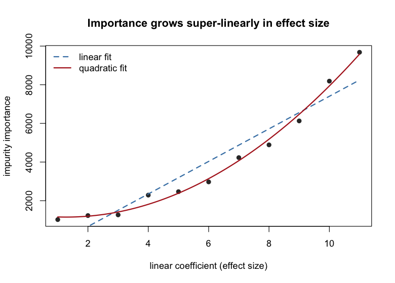
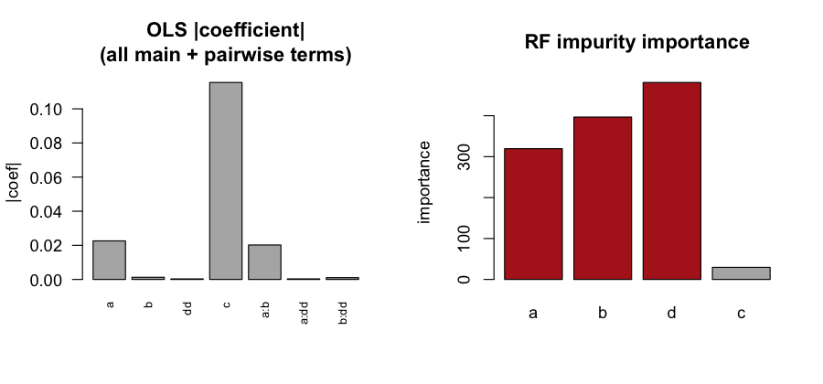
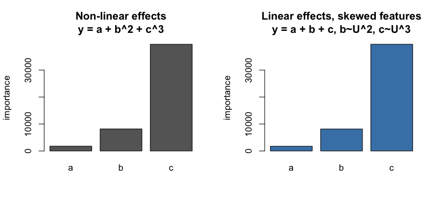

# When impurity importance misleads: interactions, non-linearity, and feature scale

**Christian Theil Have**

*Original note: 17 May 2022. Validated and rewritten: July 2026.*

## Abstract

Mean-decrease-in-impurity (MDI) variable importance is the default, cheapest way
to read a random forest, and it is routinely compared, informally, to the
coefficients of a linear model. This paper examines when that comparison breaks
down. Through five controlled experiments (all reproduced with `ranger`) we show
that impurity importance (i) orders linear effects correctly but magnifies them
super-linearly, (ii) charges interaction effects to the interacting variables,
even when those variables have no marginal effect at all, and (iii) — the central
result — *cannot distinguish a genuinely non-linear effect from a linear effect
acting on a skewed feature*. The two produce identical importances. The root
cause is that regression trees split on variance reduction, and variance is not
scale-invariant. We argue that impurity importance should be read as a detector
of *structure worth investigating*, not as an effect-size estimate, and that
partial-dependence plots recover the distinction that importance discards.

## 1. Background

For a random forest, the impurity importance of a feature is the total decrease
in node impurity attributable to splits on that feature, summed over all splits
and all trees. For classification the impurity is Gini; for regression there is
no class label at a node, so `ranger` (and most implementations) use **response
variance** as the impurity proxy — a split is scored by how much it reduces the
sum of within-child variances. This substitution is the source of every effect
studied here.

Impurity importance is known to be biased: it favours continuous and
high-cardinality features and inflates the importance of correlated predictors
(Strobl et al. 2007; Nembrini et al. 2018, *The revival of the Gini importance?*,
which introduces the bias-corrected "actual impurity reduction", AIR, exposed by
`ranger` as `importance = "impurity_corrected"`). The question here is narrower
and more practical: **if I line up impurity importances next to OLS
coefficients, when will I be misled?**

All experiments use `ranger` 0.18.0; the code that generates them and the figures
is available with the rest of the supporting material (see *Data and code
availability*). Unless noted, importances are the plain `impurity` measure (the
one the definition above describes); §2.1 compares it against
`impurity_corrected`.

## 2. Linear effects: right order, wrong magnitude

Data: `y = a + 2b + 4c`, with `a,b,c ~ U(0,1)`, n = 1000. OOB R² = 0.98.

Impurity importance ranks the features in the correct order, but the *ratios*
are distorted:

| feature | OLS coef | impurity vip (ratio) | impurity_corrected (ratio) |
|--------:|:--------:|:--------------------:|:--------------------------:|
| a       | 1        | 1.00                 | 1.00                       |
| b       | 2        | 2.32                 | 5.31                       |
| c       | 4        | 7.79                 | 23.1                       |

A coefficient ratio of 1:2:4 becomes an importance ratio of 1:2.3:7.8. The
magnification is **super-linear**. Extending to `y = a + 2b + 3c + … + 11k` (11
features, coefficients 1…11) and regressing importance on effect size, a linear
fit gives R² = 0.91 while a quadratic fit gives R² = 0.97 (Fig. 1). Importance
scales roughly with the *square* of the coefficient, because a feature with a
larger coefficient contributes more variance per split *and* is chosen for more
splits.

Note the bias correction makes this **worse**, not better: `impurity_corrected`
de-biases null (no-effect) features but does not restore scale-invariance among
real effects — its ratios (1:5.3:23) are more extreme than plain impurity's.



*Fig. 1 — Impurity importance vs. linear coefficient. The quadratic fit
(red) dominates the linear fit (blue dashed).*

**Takeaway.** Importance answers "which feature matters more" reliably for linear
effects, but "how much more" is not comparable to a coefficient.

## 3. Interactions are charged to the interacting variables

Data: a pure parity interaction with no marginal effects,

```
y = c/10 + ((a + b) mod 2),   a,b,c ∈ {0,1},   n = 10000.
```

`a` and `b` individually carry no information about `y`; only their parity does.
`c` has a small independent effect.

- **OLS** is blind: R² = 0.01, and the fitted coefficients for `a` and `b` are
  exactly 0 (only `c` survives, coef ≈ 0.10). A standard `a*b` product term does
  not rescue it — the interaction is non-linear (parity), not the bilinear form
  OLS interaction terms assume.
- **Random forest** captures it: OOB R² = 0.63. And the impurity importance
  loads almost entirely on the interacting variables: vip(a) = 483, vip(b) = 503,
  vip(c) = 16 (Fig. 2). The interaction variables outrank the one variable with a
  genuine marginal effect by ~30×.



*Fig. 2 — Same data, two views. OLS assigns `a`,`b` zero coefficient; RF impurity
importance ranks them highest.*

**Takeaway.** A high impurity importance does **not** imply a detectable marginal
effect. This is a feature, not a bug: importance surfaces variables that matter
only in combination — precisely the ones a naive linear model drops. But it means
importance and coefficients measure different things.

## 4. Why variance-splitting favours large-scale, non-linear structure

Take a noise-free, sorted dataset and sweep every possible single split,
scoring each by the sum of within-child variances. For `y = x`, `y = x²`,
`y = x³` (x = 1…1000):

| response | min split-variance | argmin index (of 1000) |
|:--------:|:------------------:|:----------------------:|
| x        | 4.2 × 10⁴          | 500 (centre)           |
| x²       | 4.3 × 10¹⁰         | 697                    |
| x³       | 4.1 × 10¹⁶         | 799                    |

Two mechanisms compound:

1. **Scale.** The achievable variance reduction grows by orders of magnitude with
   the polynomial degree. Splits driven by high-order (large-range) structure
   dominate the split-selection criterion, and each such split books a larger
   impurity decrease.
2. **Imbalance.** For a linear response the best split is central; for higher
   orders the optimal split migrates toward the high-`y` tail (index 500 → 697 →
   799). Unbalanced splits leave more structure in the large child, so *more*
   splits are needed — and every one of them is charged to the same feature.

Variance is not scale-invariant, so whatever varies on the largest scale wins
twice.

## 5. Non-linear effects (§4 confirmed on real forests)

Data: `y = a + b² + c³`, features `~ 1+U(0,1)`, n = 10000. As predicted,
vip(a) < vip(b) < vip(c): 1780 < 8168 < 39570. Importance rises faster than the
degree of the term. A linear model still estimates non-zero coefficients here,
but they are uninterpretable — the residuals are visibly non-normal, signalling
the misspecification.

## 6. The central confound: non-linearity vs. feature scale are indistinguishable

This is the result that should change how the measure is read. Construct data
with **exactly equal linear effects**, but skewed feature *distributions*:

```
a = 1 + U,   b = (1 + U)²,   c = (1 + U)³,   y = a + b + c,   n = 10000.
```

Every feature enters `y` with coefficient 1. OLS confirms it: fitted coefficients
are 1.00, 1.00, 1.00. Each unit increase in `a`, `b`, or `c` moves `y` by one
unit — there is nothing non-linear about the *effects*.

Yet the random forest reports importances of **1780 / 8168 / 39570** — a 1:4.6:22
spread. These are not merely unequal; they are **numerically identical** to the
non-linear-effects model of §5 (Fig. 3). The forest cannot tell the two
generating processes apart, because both present the same *marginal variance
structure* to the splitting criterion: a feature whose values are spread over a
cubic range delivers the same variance-reduction opportunities whether the
cubic lives in the effect (`c³`) or in the feature (`c ~ U³`).



*Fig. 3 — Identical importances from two different worlds. Left: genuinely
non-linear effects. Right: linear effects on skewed features. Impurity importance
cannot distinguish them.*

A split-variance sweep on the skewed-feature data confirms the mechanism: median
achievable split-variance is lowest for `c` (4.4) and highest for `a` (9.8), so
`c` is split earlier and more often — matching the importance ranking, even
though `c`'s effect on `y` is no larger than `a`'s.

**Takeaway.** Impurity importance conflates *effect non-linearity* with *feature
skew*. A tall importance bar can mean "this feature has a strong/non-linear
effect" **or** merely "this feature has a wide/heavy-tailed distribution." The
measure alone cannot say which.

## 7. Practical guidance

1. **Read impurity importance ordinally, and only among comparable features.**
   Treat it as a ranked shortlist of variables worth investigating, not as an
   effect size. Never place its magnitudes alongside OLS coefficients as if they
   were the same currency.
2. **A high bar is a prompt, not a conclusion.** It may reflect a marginal
   effect, an interaction (§3), a non-linear effect (§5), or nothing but a skewed
   feature distribution (§6).
3. **Disambiguate with partial-dependence plots.** PDPs recover exactly what
   importance discards: in §6 the skewed-feature model's PDPs are straight lines
   while the non-linear model's curve — same importances, different shapes. PDPs
   also expose the checkerboard signature of the §3 interaction that per-feature
   importance flattens. Curvature in a PDP is a concrete cue to add a polynomial
   or interaction term back into an interpretable model.
4. **`impurity_corrected` fixes a different problem.** It removes the bias toward
   null / high-cardinality features (use it — it is the right default), but it
   does not make importances scale-comparable across real effects; if anything it
   widens the spread (§2).
5. **If you know the structure is linear, use the linear model.** Random forests
   buy you interaction- and non-linearity-detection; when there is nothing to
   detect, OLS is both more accurate and directly interpretable.

## 8. Prevalence in the literature: method

The preceding sections establish that the pitfall exists and reproduce it on
demand; they say nothing about how often it affects a real conclusion. To
estimate that, we screened the published literature that relies on the tool most
closely associated with these importances — the `ranger` R package — for papers
whose stated conclusions depend on the magnitude or ranking of an impurity
importance without the corroboration that would guard against the biases of §§2–6.

**Corpus.** We took every work recorded by OpenAlex as citing the ranger
reference publication (Wright & Ziegler 2017; OpenAlex work `W2157395790`), 3,189
works in total. For each we retrieved bibliographic metadata from OpenAlex and,
where an open-access full text was available, the full text from Europe PMC; 773
works had retrievable open-access full text. Screening was restricted to these,
because the detail needed to judge exposure — which importance measure is used,
and whether it is corroborated — is almost never present in an abstract.

**Relevance filter.** Many papers cite ranger only for its speed or for
prediction and never interpret a variable importance. To drop these without
discarding relevant work, we required a textual mention of variable importance: a
paper was retained if its full text matched, case-insensitively, any of the
following regular-expression alternatives.

```
(variable|feature|permutation|gini|impurity)\s+importance
importance\s+(score|value|ranking|measure)
mean decrease
decrease in (impurity|gini|accuracy)
\bMDI\b   \bMDA\b   \bBoruta\b
impurity[_\s]?corrected
most important (variable|feature|predictor)
```

524 of the 773 full-text papers matched. This filter is deliberately broad. An
earlier, narrower version that additionally required a significance-testing
keyword (`importance_pvalues`, Altmann, Janitza, or Boruta) had poor recall,
because most exposed papers rank features by impurity importance with no
significance machinery at all. To quantify the broad filter's own recall we drew
a random sample of 40 non-matching full-text papers and put them through the same
screen; in total 544 papers received the full screen.

**Two-stage screen.** Each paper was read by a large language model under a fixed
instruction and asked to return a structured judgement; the verbatim prompts are
in the supporting repository (see *Data and code availability*). The screen has
two stages using different models, so that the second acts as an adversarial
check on the first.

*Stage 1 — screening.* A first model (Claude Haiku 4.5) read the full text and
recorded whether the paper uses an impurity/Gini/MDI importance, whether it
interprets that importance's magnitude or ranking, which corroborating analyses
(if any) it reports, and a Boolean flag for whether a central conclusion could
have been affected by the biases described here. The instruction made the
operative distinction explicit: the bias corrupts the magnitude and ranking of an
importance, not the binary verdict of whether a variable is used, so a significant
importance *p*-value (Altmann, Janitza, or Boruta) — which tests only that
importance ≠ 0 — does not by itself protect a conclusion. A paper was flagged only
when it leaned on the magnitude or ranking of an impurity importance for a central
conclusion *and* did not corroborate that ranking. Corroboration was defined as
any of: permutation importance, SHAP values, a partial-dependence or
accumulated-local-effects analysis, conditional importance, or held-out
predictive validation of the *selected* feature set — overall model accuracy on a
test set does not qualify, since it validates prediction, not the ranking. Every
flag had to be supported by a quoted passage.

*Stage 2 — adjudication.* Every flagged paper was independently re-read by a
second, stronger model (Claude Sonnet 5) under an explicitly adversarial
instruction: its task was to *refute* the flag. It returned a verdict of
*confirmed*, *refuted*, or *uncertain*, and confirmed only when all three
conditions held at once — the paper genuinely uses an impurity (not solely a
permutation or SHAP) importance, the ranking is central to a stated conclusion,
and the ranking is not adequately corroborated — reaching its own judgement rather
than deferring to stage 1.

## 9. Prevalence in the literature: results

The table below traces the corpus through the pipeline. Of the 544 papers
screened, 306 were judged to use an impurity importance and 125 were flagged in
stage 1. The adversarial adjudication confirmed 55, refuted 65, and could not
decide for 5, overturning roughly 56% of the stage-1 flags. The implied stage-1
precision is therefore about 44%, and raw screening counts should be discounted
accordingly.

| Stage | Count |
|-------|------:|
| Works citing ranger (OpenAlex) | 3,189 |
| With open-access full text | 773 |
| Matching the relevance filter | 524 |
| Screened (filter matches + non-match sample) | 544 |
| Using an impurity importance (stage 1) | 306 |
| Flagged (stage 1, Haiku 4.5) | 125 |
| &nbsp;&nbsp;Confirmed (stage 2, Sonnet 5) | 55 |
| &nbsp;&nbsp;Refuted | 65 |
| &nbsp;&nbsp;Uncertain | 5 |

*Note: the 544 screened papers comprise all 524 filter matches plus 20
non-matching papers screened in earlier passes before the filter was finalised,
including the random recall sample; all 524 filter matches were screened.*

Taking the confirmed count at face value, 55 of the 544 screened papers — about
10% of the importance-using full-text literature, and roughly 7% of all full-text
ranger-citing work — state a central conclusion that could have been distorted by
the biases of §§2–6 and did not cross-check it.

Two features of the confirmed set are worth drawing out. First, exposure is
concentrated in papers that use no significance machinery: the large majority of
flagged papers report no importance *p*-value or Boruta selection and simply rank
features by impurity importance. Papers that do use those methods are, if
anything, more careful, and the share of importance-using papers that pair the
importance with a corroborating analysis rises steadily across the 2016–2026 span
of the corpus. The problem is thus most acute in — though not limited to — applied
work that treats a built-in importance ranking as a finished result. Second, the
confirmed papers are not confined to low-visibility venues: their citation counts
span the full range of the corpus, so the potentially-affected conclusions include
work of substantial reach.

These figures are screening estimates from language-model judgements, not audits
of the underlying analyses. A confirmed flag means a conclusion *could* have been
affected and was not corroborated, not that it is wrong; a model's predictive
accuracy, validated separately, is unaffected either way. Establishing that a
particular ranking is actually distorted requires re-running that study's model
with an unbiased importance measure, which is beyond the scope of a text screen.

## 10. Conclusion

Impurity importance is a variance-reduction accounting, and variance is neither
scale-invariant nor able to separate an effect's shape from a feature's
distribution. Consequently it magnifies effect sizes super-linearly, attributes
interaction effects to marginally-null variables, and — most importantly —
returns identical scores for genuinely non-linear effects and for linear effects
on skewed features. Every claim in the 2022 note reproduces cleanly, and a
literature screen (§§8–9) confirms the pitfall is not merely theoretical: about
10% of importance-using ranger papers — including heavily-cited work — lean on
impurity rankings without the corroboration that would catch it. Used as a
*screening* tool and paired with partial-dependence plots to interrogate the
shortlist, impurity importance is valuable; read as a substitute for effect sizes,
it will mislead.

## Data and code availability

All code and data supporting this paper are available at
<https://github.com/cth/rf-impurity>: the R scripts that generate the controlled
experiments and figures of §§2–6 (with a one-line command to reproduce every
number cited there), the corpus-construction and full-text-retrieval pipeline, the
relevance filter, the verbatim screening and adjudication prompts, and the
per-paper structured records and verdicts behind §9.

## References

- Nembrini, König, Wright (2018). *The revival of the Gini importance?*
  Bioinformatics 34(21). [PMC6198850](https://www.ncbi.nlm.nih.gov/pmc/articles/PMC6198850/)
- Strobl, Boulesteix, Zeileis, Hothorn (2007). *Bias in random forest variable
  importance measures.* BMC Bioinformatics.
- Scheidel (2018). *Be aware of bias in RF variable importance metrics.*
- Lee (2017). *Feature Importance Measures for Tree Models — Part I.*
- Wright, Ziegler (2017). *ranger: A Fast Implementation of Random Forests for
  High Dimensional Data in C++ and R.* Journal of Statistical Software 77(1).
